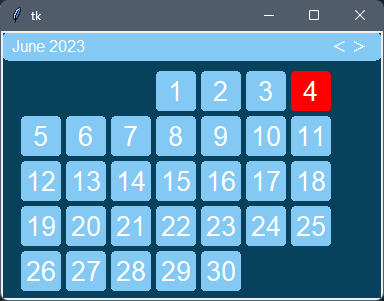
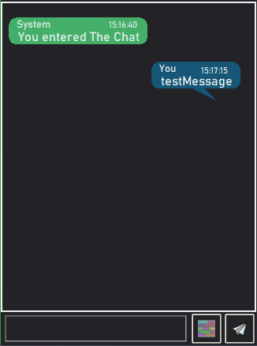

# advancedtkinter
Provides different ui Elements to make it easier to style your tkinter python app
#### Included Are
> * Scrollable-Frames, ModernButtons, Modern-Colorpicker
> * Notifications,Option Buttons
> * Html-styled tkinter via ``tkinterML``
> * ...

## Prebuilt Features 

> ### Calender & Chat
 
 

